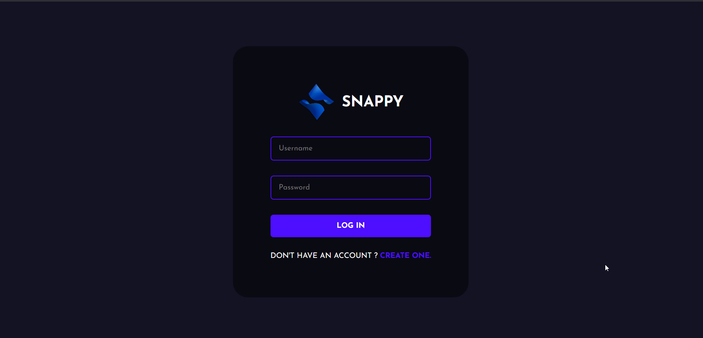

# ChatNex - Chat Application

ChatNex is chat application build with the power of MERN Stack. You can find the Demo [here](https://www.youtube.com/watch?v=b3D31oRsDKU)




## Installation Guide

### Requirements

- [Nodejs](https://nodejs.org/en/download)
- [Mongodb](https://www.mongodb.com/docs/manual/administration/install-community/)

Both should be installed and make sure mongodb is running.

```shell
git https://github.com/RohanDtu99/Real-time-chat--application-ChatNex.git
cd chatNex
```

Now rename env files from .env.example to .env

```shell
cd public
mv .env.example .env
cd ..
cd server
mv .env.example .env
cd ..
```


We are almost done, Now just start the development server.

For Frontend.

```shell
cd public
npm start
```

For Backend.

Open another terminal in folder, Also make sure mongodb is running in background.

```shell
cd server
npm run start
```

